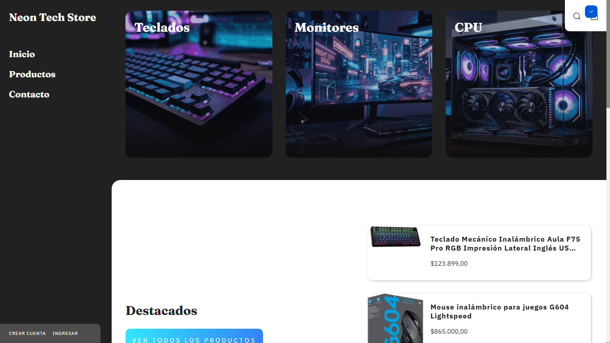

<!-- OPTIMIZACIÓN DE IMÁGENES: Guía de Implementación de WebP + Srcset -->

<!-- ANTES (Sin optimizar) -->

<!-- DESPUÉS (Optimizado con WebP + Srcset) -->
<picture>
  <source srcset="./assets/img/tienda_neon.webp 1200w, ./assets/img/tienda_neon-tablet.webp 768w, ./assets/img/tienda_neon-mobile.webp 480w" type="image/webp" media="(max-width: 1024px)" />
  <source srcset="./assets/img/tienda_neon.png 1200w, ./assets/img/tienda_neon-tablet.png 768w, ./assets/img/tienda_neon-mobile.png 480w" type="image/png" media="(max-width: 1024px)" />
  
</picture>

<!-- HERRAMIENTA: Comando para convertir PNG a WebP -->
<!-- Instalar (Mac/Linux): -->
<!-- brew install imagemagick -->
<!-- Convertir archivos: -->
<!-- for file in ./assets/img/*.png; do convert "$file" -quality 80 "${file%.png}.webp"; done -->
<!-- Crear versiones responsivas: -->
<!-- convert ./assets/img/tienda_neon.png -resize 480x320 ./assets/img/tienda_neon-mobile.png -->
<!-- convert ./assets/img/tienda_neon.png -resize 768x512 ./assets/img/tienda_neon-tablet.png -->
<!-- Luego convertir a WebP: -->
<!-- convert ./assets/img/tienda_neon-mobile.png ./assets/img/tienda_neon-mobile.webp -->
<!-- convert ./assets/img/tienda_neon-tablet.png ./assets/img/tienda_neon-tablet.webp -->

<!-- ALTERNATIVA: Usar FFmpeg -->
<!-- ffmpeg -i ./assets/img/tienda_neon.png -c:v libwebp -q:v 80 ./assets/img/tienda_neon.webp -->

<!-- RESULTADO: Reducción de tamaño aprox 50-70% -->
<!-- tienda_neon.png: ~800KB → tienda_neon.webp: ~200KB -->
<!-- tienda_neon-mobile.png: ~300KB → tienda_neon-mobile.webp: ~80KB -->

<!-- Implementar en index.html: reemplazar todas las img con <picture> tags usando srcset -->
